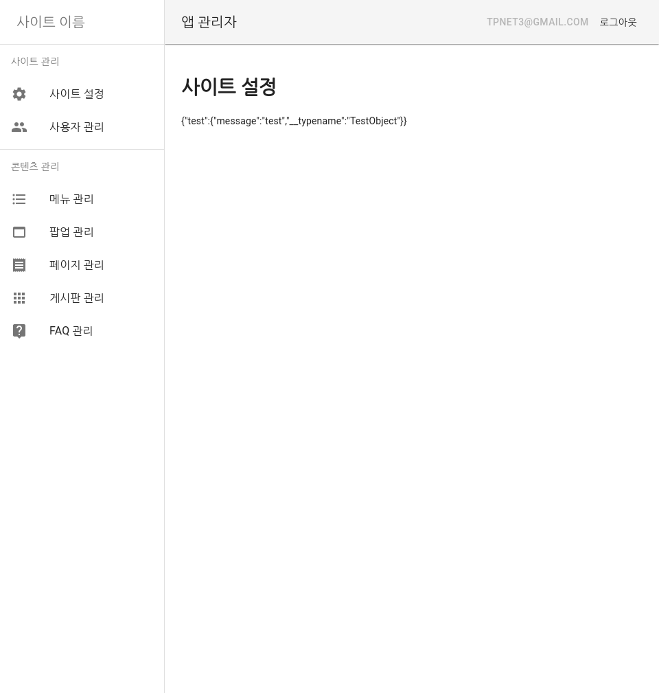
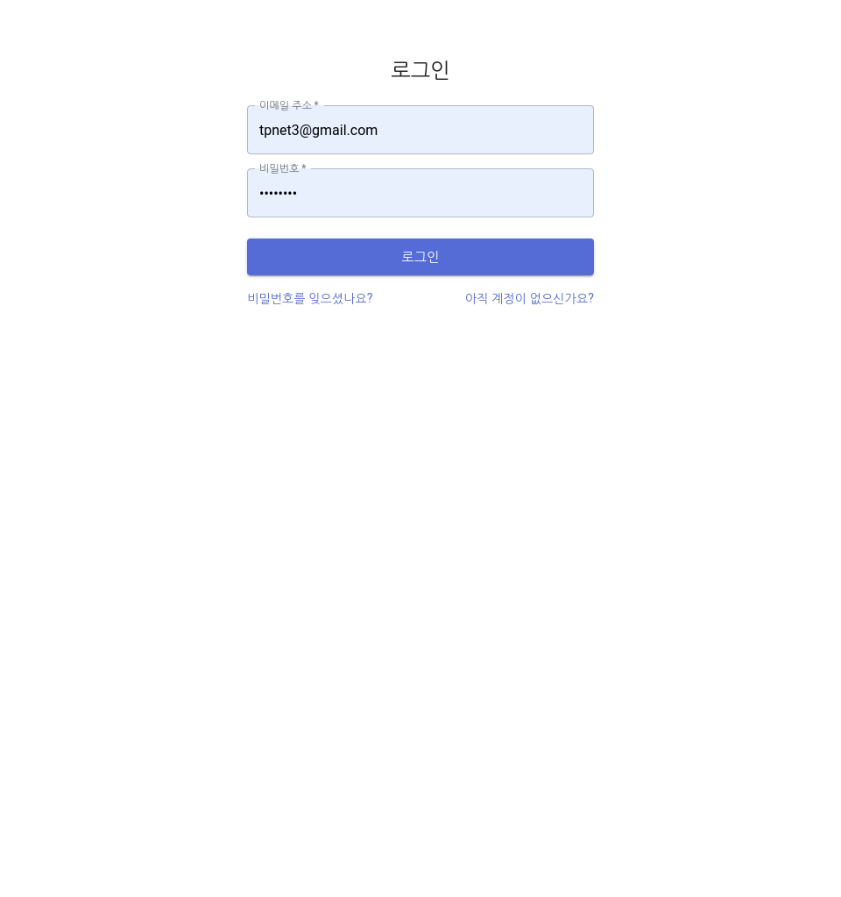
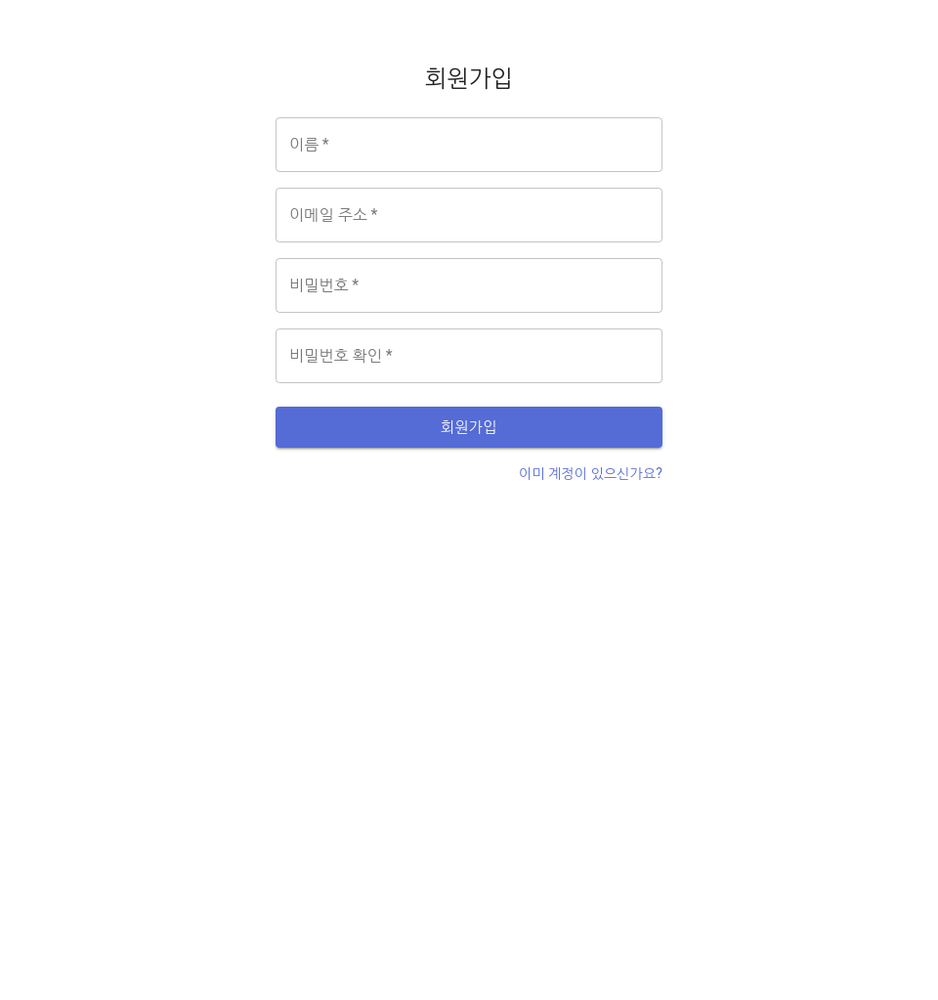

# BounceCode CMS

궁금하신게 있으시면 언제든 말씀해주세요.

카카오톡 오픈채팅: https://open.kakao.com/o/ghJjrKbb

## 서버 시작

```bash
docker-compose up --build
```

## 관리자 추가

```bash
# 회원가입 후 실행하셔야합니다.
docker-compose run app \
  bash -c "yarn admin:add --email=tpnet3@gmail.com"
```

## 스크린샷







